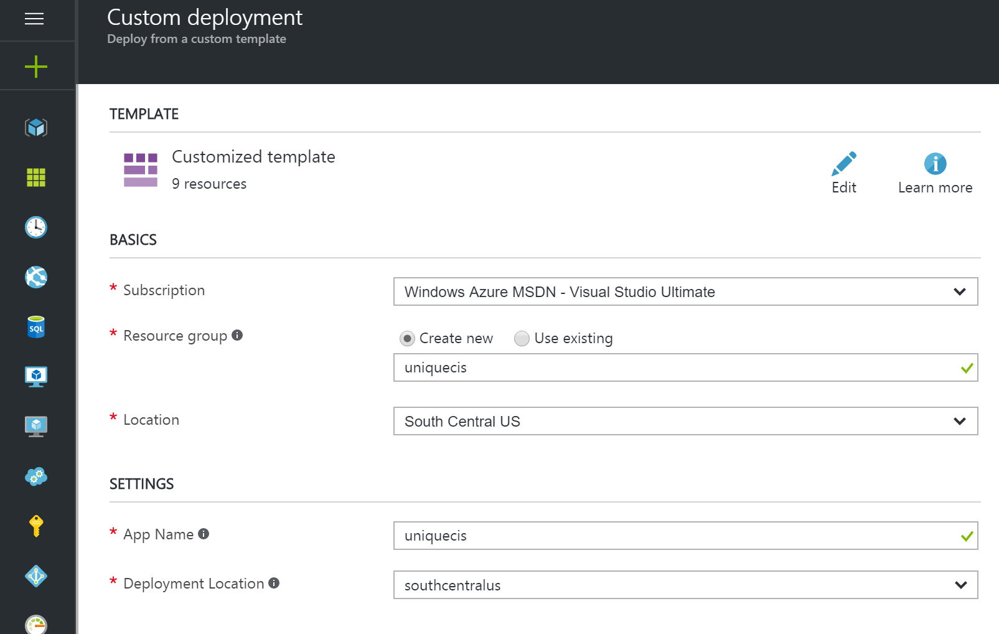

# Cortana Intelligence Workshop Prereq Deployment

This GitHub repo exists to get you ready for the Cortana Intelligence End-to-End Workshop. There are two main steps:

1. Deploy workshop environment to Azure
2. Acquire a Weather Underground API Key

## Workshop Requirements

- Microsoft Azure Subscription should be pay-as-you-go, MSDN, or EA.
   - If you are using your company's Azure subscription and your company requries that you be connected to your corporate network (through a VPN or otherwise), we recommend that you use a Trial or MSDN subscription for this workshop. This is due to the fact that you will be connecting to your subscription inside of a VM that is not connected to your corporate network.
   - Recommendation is to have each user have their own Azure subscription. This will allow every attendee to have their own sandbox.
- Please keep in mind that HDInsight cluster and VM you provision as setup for this workshop will incur charges, so provision these resources closest to the workshop date as possible.  Preferably the afternoon/night before the workshop.

## Deploy Workshop Environment to Azure

This GitHub repo can deploy the assets to Azure needed to complete the Cortana Intelligence Workshop. We are leveraging a capability of Azure called ARM templates which allow you to specifiy what your solution looks like from a deployment perspetive simply by using JSON code. This is a fairly simple use of ARM templates, but you can actually deploy very complex topologies using this technology - straight from source control. Pretty cool!!

This particular ARM template will deploy the following resources into a new Resource Group:

* An HDInsight Spark cluster with 2 worker nodes.
* An Azure ML Workspace. After the deployment is completed, you can go to https://studio.azureml.net/ and view your workspace. You will need to sign in with the same account that you use to sign in to Azure.
* A Windows 2012 R2 VM that will act as a Lab VM where you will run the Data Factory Data Management Gateway and Power BI Desktop. This VM is basically a workstation for you so you do not have to install software on your personal/work device.
* Supporting resources - both the Spark cluster and the Lab VM need a few requisite resources in order to operate such as storage accounts, networks, a public IP, etc.

All you need to do is click the "Deploy to Azure" button below and fill out the following parameters in Azure. NOTE: you will want to be signed in to your Azure subscription before clicking the button below.

When you click the "Deploy to Azure" button, you will be taken to the Azure portal and presented with a form for a new custom deployment (which uses the ARM template in this GitHub repo). You will be presented with a blade to provide some custom parameters as shown in the screenshot below.

* **Subscription** - Select the subscription you wish to use for the workshop.
* **Resource Group** - Create a new resource group and give it a globally unique name.
* **Location** - This is the location of your Resource Group. Resouces that are deployed inside this Resource Group do *not* have to be deployed to this same location.
* **App Name** - This should be a short (10 or fewer characters), but unique string that will be a prefix to all of the resources deployed. For example, if you type in *smithcis*, your Spark cluster will be called *smithcisspark* and your Lab VM will be called *smithcislab*.
    * **NOTE: Do not include any extraneous characters aside from letters (e.g. dashes, underscores, etc.).**
* **Deployment Location** - The default deployment location for the resources needed for the workshop. This does *not* have to be the same as the location chosen for the Resource Group.

## Acquire Weather Underground API Key

1. To retrieve the 10-day hourly weather forecast, you will use an API from WeatherUnderground.com. There is a free developer version that provides you access to the API you will need for this workshop.
1. Navigate to https://www.wunderground.com/signup?mode=api_signup and create an account.
1. Once your account is created and you are signed in, navigate to https://www.wunderground.com/community/mail.asp and click on the **Send Validation Email** button.
3. Check your email and complete the validation process.
3. Navigate to http://www.wunderground.com/weather/api/.
3. Click **Explore My Options**.
3. On the next page, choose the **Anvil Plan** and **Developer** pricing. This should be $0.
3. Click the **Purchase Key** button.
3. The subsequent page will have more questions about how you will use the API. Please complete this form and click the **Purchase Key** button. You can enter whatever data you would like on this form.
3. The following page will have your API key in the **Key ID** field.
15.	You will need this **Key ID** during the workshop, so please put it in a location that will be accessible to you during the workshop. An easy solution is to simply email it to yourself.
16.	To verify that your API Key is working, modify this URL to include your API Key: http://api.wunderground.com/api/YOUR_API_KEY_HERE/forecast10day/q/WA/SEA.json.
17.	Open your modified link in a browser, you should get a JSON result showing the 10-day, hourly weather forecast for the Seattle-Tacoma International Airport.

Thank you for following this setup instruction for the Cortana Intelligence Workshop. We are looking forward to having you at our workshop!!
